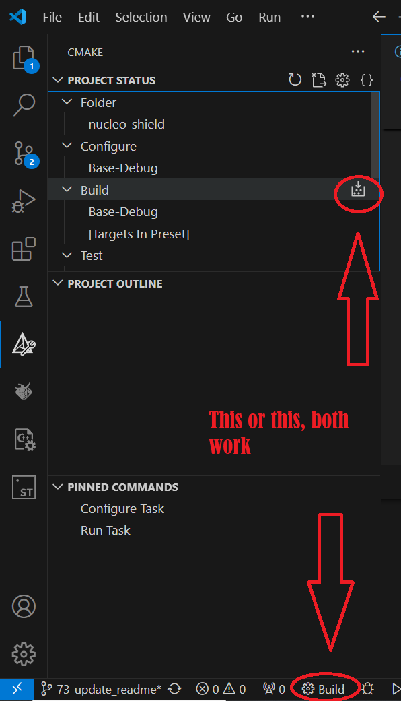

```C
                ██╗    ██╗███████╗████████╗
                ██║    ██║██╔════╝╚══██╔══╝
                ██║ █╗ ██║█████╗     ██║   
                ██║███╗██║██╔══╝     ██║   
                ╚███╔███╔╝███████╗   ██║   
                 ╚══╝╚══╝ ╚══════╝   ╚═╝   
```
A repository for group 9 CBL

## Setting Up Your Environment

1. **Install cmake:** 
    - Download and install from [Cmake download](https://cmake.org/download/).
    - For **windows**, it is recommended to choose the installer under binary distrubutions. MAKE SURE to add the cmake to path during the installation, you will be prompted for that.
    - If you are using **linux**: 
      - **Ubuntu**: `sudo apt install cmake`
      - **Arch**: I assume that you already know what to do to install cmake \\\_(-\_-)\_/
    - You can verify installation by running `cmake --version` in the terminal,cmd or powershell depending on which os you are using

2. **Install the ARM Toolchain:**
   - **Windows**: 
      - Download and install from [GNU Arm Embedded Toolchain](https://developer.arm.com/downloads/-/arm-gnu-toolchain-downloads).
      - Since we are using Nucleo-F446RE, download the arm-none-eabi tool-chain which is for bare-metal environment (without operating system).
      - MAKE SURE to add to path while installing, this will be in the last step before pressing finish in the installation

   - **macOS**: Use package managers like Homebrew 

   - **Ubuntu**: `sudo apt install gcc-arm-none-eabi`
 
   - You can verify installation by running `arm-none-eabi-gcc --version` in the terminal,cmd or powershell depending on which os you are using

3. **Install Vs Code**
   - Go to official [download page](https://code.visualstudio.com/download) and select download based on your operating systen
   - **Windows**: Follow installer
   - **Ubuntu**: double click on downloaded package and enter sudo password when prompted and should then be automatically installed
   - **Macos**: Run downloaded file

4. **Install Required VS Code Extensions:** 
   - **C/C++**: Provides IntelliSense and debugging support.
   - **Cortex-Debug**: Enables debugging STM32 devices directly from VS Code.
   - **statusbar-commands**: Makes workflow easer
   - **CMake**: Cmake to build project 
   - **CMake Tools**: For compiling the project
   - **Serial monitor**: To help recieve prints and debug messages from STM32
5. **OpenOCD download**
   - **Windows**
      - Go to the [Link](https://gnutoolchains.com/arm-eabi/openocd/)
      - download latest zip
      - unzip to program files or somewhere u want to
      - go to enviroment variables and add \<your-path\>/openocd/bin to the path, if unsure how to add enviromental variables to path check this tutorial [here](https://www.java.com/en/download/help/path.html)
   - **Ubuntu**: `sudo apt install openocd`
6. **Install Ninja**
   - For **windows**:
     - go to [the github releases page](https://github.com/ninja-build/ninja/releases) and download the ninja-win.zip and exctract for ninja.exe
     - Add the folder which the exe is in to the environmental variables. Check this [link](https://stackoverflow.com/questions/4822400/register-an-exe-so-you-can-run-it-from-any-command-line-in-windows) for help
   - **Ubuntu:**  `sudo apt install ninja-build`


## Opening the Project in VS Code

1. **Launch Visual Studio Code.**
2. **Open the Project:**
   - Go to `File > Open Folder...`
   - Navigate to the directory where you've cloned the repository and click `Open`.


## Writing your first Project!

To get you started, we would try a simple `Hello World` program!

1. Open the project in VScode
2. Head to the `app.cpp`. 
3. Feel free to play around but for now we could start with something like this:
``` C
  #include "app.hpp"
#include "serial.hpp"

extern "C"
{

    void setup()
    {
        Serial_printf("Application starting...\n");
        int test_digit = 1;
        while (1)
        {
            // Infinite loop
            Serial_printf("Application working ...%d\n", test_digit++);

            HAL_Delay(1000); // Delay for 1 second

            Serial_printf("Hello World from <add ure name here? \n");

            
        }
    }
}
```

+ I tried using a similair format to what you would normally encouter with the Arduino IDE:
    + The stuff above the while loop acts as the setup where it only runs onec
    + The code in the while loop will be the main loop that runs indefeinetly 


5. Save and now your code is ready to be built!

## Building your first project!


   
1. **Building the Project:**
   - You should have a gear logo on the bottom status bar on the left.
   - Click on that to start building
<p align="center">

</p>

2. **Flashing the Project:**
   - Connect the stm board using the USB to your PC
   - Click on the flash button in the bottom status bar to start uploading the code to the STM board
3. **Checking the serial monitor**
   - Using whichever serial monitor you prefer (or using the plugin we downloaded for vscode) you can check the output from the STM board. If everything was correct you should recieve a Helloworld! message

## FAQ:

+ Note that the `serial_printf` function doesnt support %f floats yet
+ If when flashing, vscode opens a pop up instead of using its own terminal, try following these steps:
  1. Open VSCode.
  2. Press `Ctrl + Shift + P` (or `Cmd + Shift + P` on macOS).
  3. Type "Terminal: Select Default Profile" and choose **Bash** or any terminal that can execute `.sh` scripts (e.g., gitbash or WSL for Windows).
  4. This ensures that when you run a shell script, it will use the integrated bash terminal.